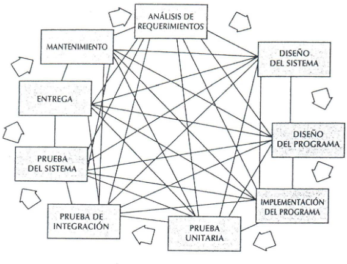
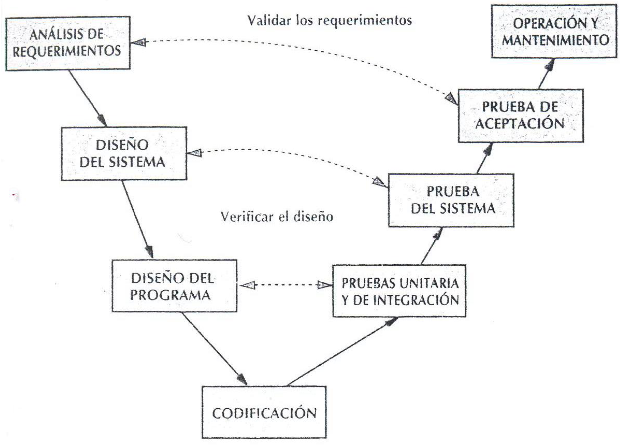
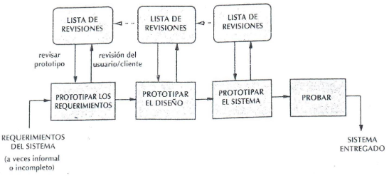

 

<h1 align="center"> 📋 Teoria 3da AE</h1>

- [Modelo de Procesos Tradicionales]()
  - [Modelo en Cascada]()
  - [Modelo en V]()
  - [Modelo Prototipos]()
  - [Desarrollo por Fases]()
  - [Modelo espiral]()
  - [Analisis Comparativo]()
- [Modelo de Procesos Metodologias Agiles]()
  - [Extreme Programming]()
  - [Scrum]()

---

# Modelo de Procesos Tradicionales

- Proceso
  Actividades que involucran, restricciones y recursos que producen una determinada salida
- Características
  - Establece todas las actividades
  - Utiliza recursos, está sujeto a restricciones y genera productos intermedios y finales
  - Puede estar compuesto por subprocesos
  - Cada actividad tiene entradas y salidas definidas
  - Las actividades se organizan en una secuencia
  - Existen principios que orientan sobre las metas de cada actividad
  - Las restricciones pueden aplicarse a una actividad, recurso o producto.
- Ciclo de vida 
  - Proceso que implica la construcción de un producto
- Ciclo de vida del Software
  Describe la vida del producto de software desde su concepción hasta su  implementación, entrega utilización y mantenimiento
- Modelos de proceso de software
  - Es una representación abstracta de un proceso del software.
    -  Modelo de proceso 
    -  Paradigma de software
    -  Ciclo de vida del software
    - Todos son Términos Equivalentes 
- Modelos Prescriptivos
  - Prescriben un conjunto de elementos del proceso: actividades del marco de trabajo, acciones de la ingeniería del software, tareas, aseguramiento de la calidad y mecanismos de control.
  - Cada modelo de proceso prescribe también un “flujo de trabajo”, es decir de que forma los elementos del proceso se interrelacionan entre sí.
- Modelos descriptivos
  - Descripción en la forma en que se realizan en la realidad
- Ambos modelos deberían ser iguales

---
## Modelo en Cascada

- Las etapas se representan cayendo en cascada
- Cada etapa de desarrollo se debe completar antes que comience la siguiente 
- Útil para diagramar lo que se necesita hacer
- Su simplicidad hace que sea fácil explicarlo a los clientes

#### Dificultades

- No existen resultados concretos hasta que todo este terminado.
- Las fallas más triviales se encuentran al comienzo del período de prueba y las más graves al final.
- La eliminación de fallas suele ser extremadamente difícil durante las últimas etapas de prueba del sistema.
- Deriva del mundo del hardware y presenta una visión de manufactura sobre el desarrollo de software.
- El software no se desarrolla de la misma manera
- La necesidad de prueba con la computadora aumenta exponencialmente durante las etapas 
-inales de prueba.
- "CONGELAR" una fase es poco realista.
- Existen errores, cambios de parecer, cambios en el ambiente

Modelo de la realidad (Sin control entre las etapas)

Con prototipo

---
## Modelo en V

- Demuestra como se relacionan las actividades de prueba con las de análisis y diseño.
- Sugiere que la prueba unitaria y de integración también sea utilizada para verificar el diseño del programa
- La vinculación entre los lados derecho e izquierdo implica que, si se encuentran problemas durante la verificación y validación, entonces el lado izquierdo de la V puede ser ejecutado nuevamente para solucionar el problema.

---
## Modelo Prototipos

- Un prototipo es un producto parcialmente desarrollado que permite que clientes y desarrolladores examinen algunos aspectos del sistema propuesto, y decidan si éste es adecuado o correcto para el producto terminado.
- Esta es una alternativa de especificación para tratar mejor la incertidumbre, la ambigüedad y la volubilidad de los proyectos reales.

#### Tipos
- Evolutivos
  - El objetivo es obtener el sistema a entregar.
  - Permite que todo el sistema o alguna de sus partes se construyan rápidamente para comprender o aclarar aspectos y asegurar que el desarrollador, el usuario y el cliente tengan una comprensión unificada tanto de lo que se necesita como de lo que se propone como solución
- Descartables 
  - No tiene funcionalidad
  - Se utilizan herramientas de modelado

#### Proyectos candidatos
- Usuarios que no examinarán los modelos abstractos
- Usuarios que no determinarán sus requerimientos inicialmente
- Sistemas con énfasis en los formatos de E/S más que en los detalles algorítmicos
- Sistemas en los que haya que explorar aspectos técnicos
- Si el usuario tiene dificultad al tratar con los modelos gráficos para modelar los requerimientos y el comportamiento
- Si se enfatiza el aspecto de la interfaz humana

#### Para asegurar el éxito
- Debe ser un sistema con el que se pueda experimentar
- Debe ser comparativamente barato (< 10%)
- Debe desarrollarse rápidamente
- Énfasis en la interfaz de usuario
- Equipo de desarrollo reducido
- Herramientas y lenguajes adecuados

---

## Desarrollo por Fases

Se desarrolla el sistema de tal manera que puede ser entregado en piezas. Esto implica que existen dos sistemas funcionando en paralelo: el sistema operacional y el sistema en desarrollo.

- Incremental
  - El sistema es particionado en subsistemas de acuerdo con su funcionalidad. Cada entrega agrega un subsistema.
- Iterativo
  - Entrega un sistema completo desde el principio y luego aumenta la funcionalidad de cada subsistema con las nuevas versiones

Sistema completo con funcionalidad básica

---
## Modelo espiral (Boehm)

- Combina las actividades de desarrollo con la gestión del riesgo 
- Trata de mejorar los ciclos de vida clásicos y prototipos.
- Incorpora objetivos de calidad y gestión de riesgos
- Elimina errores y alternativas no atractivas al comienzo
- Permite iteraciones, vuelta atrás y finalizaciones rápidas
- Cada ciclo empieza identificando:
  - Los objetivos de la porción correspondiente
  - Las alternativas
  - Restricciones
- Cada ciclo se completa con una revisión que incluye todo el ciclo anterior y el plan para el siguiente

---
## Analisis Comparativo

Clasico

Incremental

Prototipo Evolutivo

---

# Modelo de Procesos Metodologias Agiles

La ingeniería de software ágil combina una filosofía y un conjunto de directrices de desarrollo.

- La filosofía busca 
  - La satisfacción del cliente y la entrega temprana del software incremental
  - Equipos de proyectos pequeños y con alta motivación 
  - Métodos informales un mínimo de productos de trabajo de la ingeniería de software 
  - Una simplicidad en general
- Las directrices resaltan
  - La entrega sobre el análisis y el diseño, aunque estas actividades no se descartan
  - La comunicación activa y continua entre los desarrolladores y el cliente

El desarrollo ágil e software son métodos de ingeniería del software basados en el desarrollo iterativo e incremental, donde los requerimientos y soluciones evolucionan mediante la colaboración de grupo auto organizados y multidisciplinares. 

Existen muchos métodos de desarrollo ágil
- la mayoría minimiza riesgos desarrollando software en cortos lapsos de tiempo. 
- El software desarrollado en una unidad de tiempo es llamado una iteración, la cual debe durar de una a cuatro semanas. Cada iteración del ciclo de vida incluye: 
  - Planificación, análisis de requerimientos, diseño, codificación, revisión y documentación. 
  - Una iteración no debe agregar demasiada funcionalidad para justificar el lanzamiento del producto al mercado, pero la meta es tener una «demo» (sin errores) al final de cada iteración. 
  - Al final de cada iteración el equipo vuelve a evaluar las prioridades del proyecto.